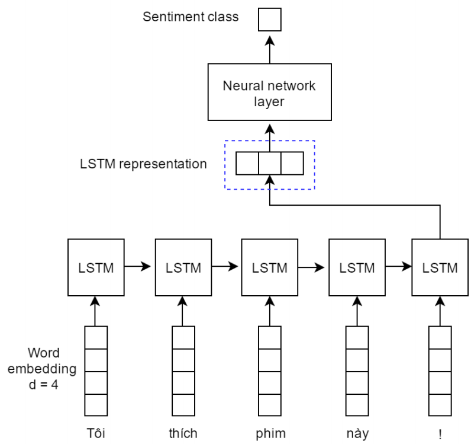

# Case study: *sentiment analysis*

## Problem description

A comparison of models will be presented using the IMDB dataset, a collection of movie reviews.

   * The aim is determining whether a review is positive or negative (binary classification).
   * The training set has $25,000$ reviews.
   * There are $5 000$ explanatory variables, which represent the words in the article; each variable indicates the presence or absence of a specific word (except for the recurrent neural network).
   * The *accuracy* will be calculated in the validation set, which has $ 25,000 $ observations.
  
More details regarding the datasets [here](https://ai.stanford.edu/~amaas/data/sentiment/).

In this report only the code concerning neural networks will be reported, not that of all the other statistical models, as they are not a topic of interest. In the conclusion you will find, however, the comparison of the results.

## Import the Keras library

```{r, results="hide", message=FALSE}
devtools::install_github("rstudio/keras")
library(keras)
install_keras()
```

Run the code below if you wish to set in *seed* and obtain reproducible results.

```{r}
library(reticulate)
py_run_string("import numpy as np;
import tensorflow as tf;
import random as python_random;
np.random.seed(123);
python_random.seed(123);
tf.random.set_seed(123);")
```

## Data ingestion

Next, we define two variables necessary for *sentiment analysis*, or in general the *text mining*:

   * `max_features`: generally when text analysis is performed, we refer to a vocabulary, that is a collection of words sorted by the frequency in which they occur in a corpus of documents; among these words, only the *n* most frequent words will be considered, where *n* is the value associated with the `max_features` variable; all remaining words will be replaced with a generic `2L` value.
   * `maxlen`: is the maximum length of a sentence; if a sentence is longer than the value of this variable, it will be cut off.

```{r}
max_features <- 5000
maxlen <- 500

imdb <- dataset_imdb(num_words = max_features)
c(c(x_train, train_labels), c(x_test, test_labels)) %<-% imdb
```

## Data preparation

Generally the first preparation step is the **tokenization**, that is the association of an integer value to each word. This step is not necessary in this case, because the sequences are already *tokenized*.

Next, we define a function that will be useful later in the analysis: `vectorize_sequences`. This function transforms the entire dataset, performing the dichotomization of the words in the sentences.

```{r}
vectorize_sequences <- function(sequences, dimension = max_features) {
# Function that applies one-hot-encoding to the sequences.
# Input:
# - sequences: list of sequences; each sequence has length equal to the length of the sentence, and each int value of the sequence corresponds to a word.
# - dimension: max number of words to include; words are ranked by how often they occur (in the training set) and only the most frequent words are kept.
# Output:
# - results: matrix of dim = (n, dimension); each row represents a different sentence, and each column represents a different word; the matrix is filled by 0 and 1 values, depending if the word is present in that sentence or else.
results <- matrix(0, nrow = length(sequences), ncol = dimension)
for (i in 1:length(sequences)) results[i, sequences[[i]]] <- 1
return(results)
}

y_train <- as.numeric(train_labels)
y_test <- as.numeric(test_labels)
```

## Deep Neural Network

Specify the neural network's architecture:

   * two *fully-connected* layers are used, the first with $32$ nodes and the second with $16$.
   * the *ReLU* function is used as activation function in the hidden layers, and the *logistic* is the activation function of the output layer.

```{r, message=FALSE, warning=FALSE}
model <- keras_model_sequential() %>%
layer_dense(units = 32, activation = "relu", input_shape = c(max_features)) %>%
layer_dense(units = 16, activation = "relu") %>%
layer_dense(units = 1, activation = "sigmoid")

model
```

Compile the model:

   * the optimizer used is `rmsprop`, with the *learning rate* equals to $0.001$;
   * the *cross-entropy* is used as loss function, and the *accuracy* is the evaluation metric.

```{r}
model %>% compile(
  optimizer = optimizer_rmsprop(lr = 0.001),
  loss = "binary_crossentropy",
  metrics = c("accuracy")
)
```

Effettuare il training della rete neurale. Come input alla rete neurale, diamo le sequenze dicotomizzate, applicando la funzione `vectorize_sequences` al dataset `x_train`. 

```{r echo=TRUE, warning=FALSE}
history <- model %>% fit(
  x = vectorize_sequences(x_train), 
  y = y_train,
  epochs = 10,
  batch_size = 32,
  validation_split = 0.2,
  verbose = 1
)
```

The plot, representing the loss function and the accuracy in relation to the number of epochs, is shown below.

```{r, fig.height=5, fig.width=7, out.width='100%', message=FALSE}
plot(history)
```

Evaluating the model on the test set.

```{r, message = FALSE}
results <- model %>% evaluate(
  x = vectorize_sequences(x_test), 
  y = y_test,
  verbose = 0
)

print(paste("Loss on test data:", results["loss"]))
print(paste("Accuracy on test data:", results["accuracy"]))
```

## Recurrent neural network (lstm)

Specify the neural network's architecture:

   * The first layer is an *embedding* layer, which transforms each word into a vector of size $128$
   * The second layer is an **LSTM** layer, an enhanced version of the recurrent layer.

{width=480px, height=432px}

```{r, message=FALSE, warning=FALSE}
model <- keras_model_sequential() %>%
layer_embedding(input_dim = max_features, output_dim = 128) %>%
layer_lstm(units = 32) %>%
layer_dense(units = 1, activation = "sigmoid")

model
```

Compile the model:

   * the optimizer used is `rmsprop`, with a *learning rate* of $0.001$;
   * the *cross-entropy* is used as loss function, and the *accuracy* is the evaluation metric.

```{r}
model %>% compile(
  optimizer = optimizer_rmsprop(lr = 0.001),
  loss = "binary_crossentropy",
  metrics = c("accuracy")
)
```

Now it's time to train the neural network. Before giving the sequences as input, we apply the `pad_sequences` function: this function applies a maximum length to the sequences, in this case equals to *max_len*. Moreover, it applies **padding** to the sequences shorter than *max_len*; the *padding* adds a bunch of elements all equal to $0$ (zero) at the end of the sequence, until its length becomes *max_len*. This technique is necessary because the neural network requires that the input sequences have all the same length.

```{r echo=TRUE}
history <- model %>% fit(
  x = pad_sequences(x_train, maxlen = maxlen), 
  y = y_train,
  epochs = 10,
  batch_size = 32,
  validation_split = 0.2,
  verbose = 1
)
```

The plot, representing the loss function and the accuracy in relation to the number of epochs, is shown below.

```{r, fig.height=5, fig.width=7, out.width='100%', message=FALSE}
plot(history)
```

Evaluating the model on the test set.

```{r}
results <- model %>% evaluate(
  x = pad_sequences(x_test, maxlen = maxlen), 
  y = y_test,
  verbose = 0
)

print(paste("Loss on test data:", results["loss"]))
print(paste("Accuracy on test data:", results["accuracy"]))
```

## Results

| **Model**                | **Accuracy**    |
|--------------------------|-----------------|
| Recurrent neural network | 88.4%           |
| Lasso regression         | 87.0%           |
| Logistic regression      | 86.2%           |
| Deep neural network      | 86.1%           |
| Random forest            | 84.7%           |
| Bagging                  | 77.0%           |
| Adaboost                 | 72.5%           |
| Gradient boosting        | 70.1%           |
