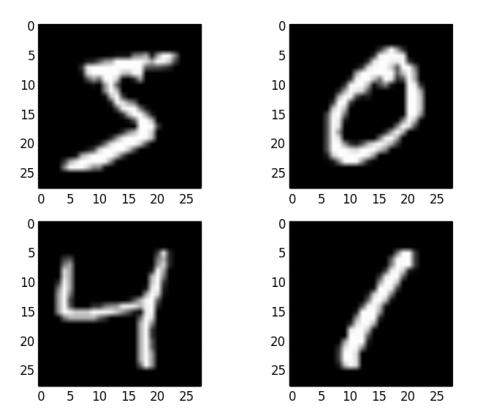

# Case study: image classification

## Problem description

A comparison of models will be made using the MNIST dataset, a collection of images representing handwritten digits.

   * The aim is to classify the represented digit (10-classes multinomial classification).
   * The training set has $ 21,000 $ observations (images).
   * Accuracy will be calculated in the validation set, which has $ 10 500 $ observations.
  

  
More details of the datasets [here] (http://yann.lecun.com/exdb/mnist/).

In this report only the code concerning neural networks will be reported, not that of all the other statistical models, as they are not a topic of interest. In the conclusion you will find, however, the comparison of the results.

## Import the Keras library

```{r, results="hide", message=FALSE}
devtools::install_github("rstudio/keras")
library(keras)
install_keras()
```

Run the code below if you wish to set in *seed* and obtain reproducible results.

```{r}
library(reticulate)
py_run_string("import numpy as np;
import tensorflow as tf;
import random as python_random;
np.random.seed(123);
python_random.seed(123);
tf.random.set_seed(123);")
```

## Data ingestion

Data will be downloaded automatically with the following commands, which are available thanks to the `keras` library.

```{r}
mnist <- dataset_mnist()
train_images <- mnist$train$x
train_labels <- mnist$train$y
test_images <- mnist$test$x
test_labels <- mnist$test$y
```

## Data preparation

Normalize the input data, rescaling them between 0 and 1.

```{r}
train_images <- train_images / 255
test_images <- test_images / 255
```

Transform the target variable into a categorical variable (using one-hot encoding).

```{r}
train_labels <- to_categorical(train_labels)
test_labels <- to_categorical(test_labels)
```

## Deep Neural Network

Specify the neural network's architecture:

   * image size is $28\times28\times1 $, but the *feed-forward neural neutwork* takes only one-dimensional vectors as input; the pixels of the input image are therefore concatenated into a single vector of size $784$;
   * 3 hidden layers of size $256$, $128$, $6$ respectively are used;
   * the *ReLU* function is used as the activation function in the hidden layers, and the *softmax* function in the output layer.

```{r, warning=FALSE}
model <- keras_model_sequential() %>%
layer_dense(units = 256, activation = "relu", input_shape = c(28 * 28)) %>%
layer_dense(units = 128, activation = "relu", input_shape = c(28 * 28)) %>%
layer_dense(units = 64, activation = "relu", input_shape = c(28 * 28)) %>%
layer_dense(units = 10, activation = "softmax")

model
```

Compile the model:

   * the optimizer used is `adam`, with the *learning rate* equals to $0.001$;
   * the *cross-entropy* is used as loss function, and *accuracy* is the evaluation metric.

```{r}
model %>% compile(
  optimizer = optimizer_adam(lr = 0.001),
  loss = "categorical_crossentropy",
  metrics = c("accuracy")
)
```

Train the neural network.

```{r, message=FALSE, warning=FALSE}
history <- model %>% fit(
  x = array_reshape(train_images, c(60000, 28 * 28)), 
  y = train_labels, 
  epochs = 10, 
  batch_size = 32,
  validation_split = 0.2,
  verbose = 1
)
```

The plot, representing the loss function and the accuracy in relation to the number of epochs, is shown below.

```{r, fig.height=5, fig.width=7, out.width='100%', message=FALSE}
plot(history)
```

Evaluating the model on the test set.

```{r}
results <- model %>% evaluate(
  x = array_reshape(test_images, c(10000, 28 * 28)), 
  y = test_labels,
  verbose = 0
)

print(paste("Loss on test data:", results["loss"]))
print(paste("Accuracy on test data:", results["accuracy"]))
```

## Convolutional neural network

Specify the neural network's architecture:

   * the *convolutional* part of the model is a sequence of layers of type `conv`->` pool`-> `conv`->` pool`-> `conv`;
   * the *fully-connected* part is a hidden layer of size $ 64 $;
   * the *ReLU* function is used as the activation function in the hidden layers, and *softmax* is the activation function of the output layer.

```{r}
model <- keras_model_sequential() %>%
layer_conv_2d(filters = 32, kernel_size = c(3, 3), activation = "relu", input_shape = c(28, 28, 1)) %>%
layer_max_pooling_2d(pool_size = c(2, 2)) %>%
layer_conv_2d(filters = 64, kernel_size = c(3, 3), activation = "relu") %>%
layer_max_pooling_2d(pool_size = c(2, 2)) %>%
layer_conv_2d(filters = 64, kernel_size = c(3, 3), activation = "relu") %>%
layer_flatten() %>%
layer_dense(units = 64, activation = "relu") %>%
layer_dense(units = 10, activation = "softmax")

model
```

Compile the model:

   * the optimizer used is `adam`, with the *learning rate* equals to $0.001$;
   * the *cross-entropy* is used as loss function, and the *accuracy* is the evaluation metric.

```{r}
model %>% compile(
  optimizer = optimizer_adam(lr = 0.001),
  loss = "categorical_crossentropy",
  metrics = c("accuracy")
)
```

Train the neural network.

```{r, message=FALSE}
history <- model %>% fit(
  x = array_reshape(train_images, c(60000, 28, 28, 1)), 
  y = train_labels, 
  epochs = 10, 
  batch_size = 32,
  validation_split = 0.2,
  verbose = 1
)
```

The plot, representing the loss function and the accuracy in relation to the number of epochs, is shown below.

```{r, fig.height=5, fig.width=7, out.width='100%', message=FALSE}
plot(history)
```

Evaluating the model on the test set.

```{r}
results <- model %>% evaluate(
  x = array_reshape(test_images, c(10000, 28, 28, 1)), 
  y = test_labels,
  verbose = 0
)

print(paste("Loss on test data:", results["loss"]))
print(paste("Accuracy on test data:", results["accuracy"]))
```

## Results

| **Model**                    | **Accuracy**    |
|------------------------------|-----------------|
| Convolutional neural network | 99.2%           |
| Deep neural network          | 97.9%           |
| Support vector machine       | 97.6%           |
| Gradient boosting            | 97.1%           |
| K-nearest neighbours         | 96.3%           |
| Random forest                | 96.1%           |
| Classification tree          | 87.6%           |