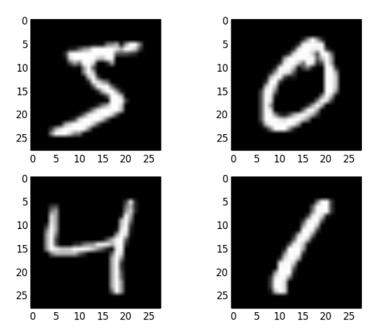

# Caso di studio: classificazione di immagini

## Descrizione del problema

Verrà effettuato un confronto di modelli utilizzando il dataset MNIST, una raccolta di immagini rappresentanti cifre scritte a mano.

  * Lo scopo è classificare la cifra rappresentata (classificazione multinomiale a 10 classi).
  * L'insieme di stima è composto da $21 000$ osservazioni (immagini).
  * Verrà calcolata l'accuratezza nell'insieme di verifica, composto da $10 500$ osservazioni.
  

  
Per maggiori dettagli riguardo i dati, consultare questo [link](http://yann.lecun.com/exdb/mnist/).

In questo report verrà riportato solamente il codice riguardante le reti neurali, e non quello di tutti gli altri modelli statistici, in quanto non sono argomento di interesse. Nelle conclusioni potrete trovare, tuttavia, il confronto dei risultati.

## Caricamento della libreria Keras

```{r, results="hide", message=FALSE}
devtools::install_github("rstudio/keras")
library(keras)
install_keras()
```

Eseguite il codice qui in seguito, se desiderate impostare in *seed* ed ottenere risultati riproducibili.

```{r}
library(reticulate)
py_run_string("import numpy as np;
import tensorflow as tf;
import random as python_random;
np.random.seed(123);
python_random.seed(123);
tf.random.set_seed(123);")
```

## Caricamento dei dati

I dati verranno scaricati automaticamente con i seguenti comandi, disponibili grazie alla libreria `keras`.

```{r}
mnist <- dataset_mnist()
train_images <- mnist$train$x
train_labels <- mnist$train$y
test_images <- mnist$test$x
test_labels <- mnist$test$y
```

## Preparazione dei dati

Normalizzare i dati di input, riscalandoli tra 0 e 1.

```{r}
train_images <- train_images / 255
test_images <- test_images / 255
```

Trasformare la variabile risposta in variabile categoriale (usando il one-hot encoding).

```{r}
train_labels <- to_categorical(train_labels)
test_labels <- to_categorical(test_labels)
```

## Deep Neural Network

Specificare l'architettura della rete neurale:

  * le immagini hanno una dimensione di $28\times28\times1$, ma la *feed-forward neural neutwork* prende in input solamente vettori unidimensionali; i pixel dell'immagine di input vengono quindi concatenati in un unico vettore di dimensione $784$;
  * vengono utilizzati 3 strati latenti di dimensione $256$, $128$, $64$ rispettivamente;
  * viene utilizzata la funzione *ReLU* come funzione di attivazione negli strati latenti, e la funzione *softmax* nello strato di output. 

```{r, warning=FALSE}
model <- keras_model_sequential() %>%
layer_dense(units = 256, activation = "relu", input_shape = c(28 * 28)) %>%
layer_dense(units = 128, activation = "relu", input_shape = c(28 * 28)) %>%
layer_dense(units = 64, activation = "relu", input_shape = c(28 * 28)) %>%
layer_dense(units = 10, activation = "softmax")

model
```

Compilare il modello:

  * l'ottimizzatore utilizzato è `adam`, con un *learning rate* pari a $0.001$;
  * viene utilizzata la *cross-entropia* come funzione di perdita, e l'*accuratezza* come metrica di valutazione.

```{r}
model %>% compile(
  optimizer = optimizer_adam(lr = 0.001),
  loss = "categorical_crossentropy",
  metrics = c("accuracy")
)
```

Training della rete neurale.

```{r, message=FALSE, warning=FALSE}
history <- model %>% fit(
  x = array_reshape(train_images, c(60000, 28 * 28)), 
  y = train_labels, 
  epochs = 10, 
  batch_size = 32,
  validation_split = 0.2,
  verbose = 1
)
```

In seguito viene rappresentato il grafico della funzione di perdita e dell'accuratezza in funzione del numero di epoche.

```{r, fig.height=5, fig.width=7, out.width='100%', message=FALSE}
plot(history)
```

Valutazione del modello sui dati di test.

```{r}
results <- model %>% evaluate(
  x = array_reshape(test_images, c(10000, 28 * 28)), 
  y = test_labels,
  verbose = 0
)

print(paste("Loss on test data:", results["loss"]))
print(paste("Accuracy on test data:", results["accuracy"]))
```

## Convolutional neural network

Specificare l'architettura della rete neurale:

  * nella parte convoluzionale viene utilizzata una sequenza di layer di tipo `conv`->`pool`->`conv`->`pool`->`conv`;
  * nella parte *fully-connected* viene utilizzato uno strato latente di dimensione $64$;
  * viene utilizzata la funzione *ReLU* come funzione di attivazione negli strati latenti, e la funzione *softmax* nello strato di output.

```{r}
model <- keras_model_sequential() %>%
layer_conv_2d(filters = 32, kernel_size = c(3, 3), activation = "relu", input_shape = c(28, 28, 1)) %>%
layer_max_pooling_2d(pool_size = c(2, 2)) %>%
layer_conv_2d(filters = 64, kernel_size = c(3, 3), activation = "relu") %>%
layer_max_pooling_2d(pool_size = c(2, 2)) %>%
layer_conv_2d(filters = 64, kernel_size = c(3, 3), activation = "relu") %>%
layer_flatten() %>%
layer_dense(units = 64, activation = "relu") %>%
layer_dense(units = 10, activation = "softmax")

model
```

Compilare il modello:

  * l'ottimizzatore utilizzato è `adam`, con un *learning rate* pari a $0.001$;
  * viene utilizzata la *cross-entropia* come funzione di perdita, e l'*accuratezza* come metrica di valutazione.

```{r}
model %>% compile(
  optimizer = optimizer_adam(lr = 0.001),
  loss = "categorical_crossentropy",
  metrics = c("accuracy")
)
```

Training della rete neurale.

```{r, message=FALSE}
history <- model %>% fit(
  x = array_reshape(train_images, c(60000, 28, 28, 1)), 
  y = train_labels, 
  epochs = 10, 
  batch_size = 32,
  validation_split = 0.2,
  verbose = 1
)
```

In seguito viene rappresentato il grafico della funzione di perdita e dell'accuratezza in funzione del numero di epoche.

```{r, fig.height=5, fig.width=7, out.width='100%', message=FALSE}
plot(history)
```

Valutazione del modello sui dati di test.

```{r}
results <- model %>% evaluate(
  x = array_reshape(test_images, c(10000, 28, 28, 1)), 
  y = test_labels,
  verbose = 0
)

print(paste("Loss on test data:", results["loss"]))
print(paste("Accuracy on test data:", results["accuracy"]))
```

## Risultati

| **Modello**                  | **Accuratezza** |
|------------------------------|-----------------|
| Convolutional neural network | 99.2%           |
| Deep neural network          | 97.9%           |
| Support vector machine       | 97.6%           |
| Gradient boosting            | 97.1%           |
| K-nearest neighbours         | 96.3%           |
| Random forest                | 96.1%           |
| Albero di classificazione    | 87.6%           |